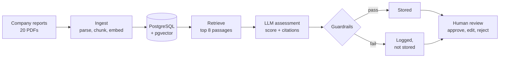

# Impact Lens

Impact Lens scores listed companies against impact investing themes, using only what the companies say in their own annual and sustainability reports. Each score has to point to the page it came from. If a quote or a figure doesn't match the source, the answer is thrown out. A person then approves, corrects or rejects what's left.

I started this because I wanted to understand how an LLM-based assessment tool works from the database up, and where it goes wrong. The second part turned out to be the more interesting one.

It isn't finished. The database, the document pipeline, the assessment step, the guardrails, an evaluation against my own labels and a review screen all work. Portfolio analytics, tests and a cloud deployment don't exist yet.

## How it works



Each report is read page by page and cut into passages of about 300 words, which keep their page number. A small embedding model on my laptop turns every passage into a vector, and all of it goes into PostgreSQL.

To assess a company on a theme, I pull the eight passages closest in meaning to the theme definition and hand them to the model with a fixed, versioned prompt. It returns a score from 0 (no exposure) to 3 (core business), a short rationale, and a citation with an exact quote for each claim. If the passages don't support a score, it's supposed to say so.

The answer is checked before anything is saved. What passes goes to a review screen, where a person makes the final call.

## What gets checked

| Check | What it catches |
| --- | --- |
| Schema | The answer has the wrong shape or a value out of range. It gets one retry |
| Citation exists | The model cites a passage it was never given |
| Quote matches | The quote isn't in the cited passage |
| No evidence, no claim | A score above 0 without a single valid citation |
| Revenue share supported | A percentage that isn't written in a cited passage |
| Injection | Passage text that reads like an instruction to the model. Flagged only |

## What I found

I ran 20 companies against 4 themes, so 80 assessments, with Claude Haiku 4.5. The 20 reports came to 8,328 passages.

### The first run

With the first prompt, 72 assessments were stored and 8 were rejected. Six of the rejections were altered quotes. Three were a revenue share the source doesn't state. One answer managed both.

Ten percent rejected sounds fine until you look at which ones. All 8 were cases where the company really does have exposure to the theme. Most of the 80 are easy zeros, like a tobacco company on clean energy. Of the 27 that aren't, about 30% were rejected.

The Shell result is the one I keep coming back to. On clean energy the model gave a score of 2, high confidence, and a revenue share of 15%. The citations were real. But the 15% came from a chart of energy delivered by volume, which isn't revenue, and it treated all power sales as clean. It read well and the main number was wrong.

### Measured against my own labels

I labelled 40 of the harder pairs by hand and compared two prompt versions. The second ties the scale to revenue share, excludes the company's own operations, and demands exact quotes.

| | Prompt v1 | Prompt v2 |
| --- | --- | --- |
| Passed guardrails | 32 of 40 | 35 of 40 |
| Exact match with my score | 53% | 57% |
| Within one point | 91% | 94% |
| Average difference (model minus me) | +0.31 | +0.14 |

The second prompt cut rejections and made the model less generous. It stopped giving a 1 to anything that merely touched a theme. Exact agreement hardly changed, and three more matches out of 40 is within the noise. The model still gives the top score too easily. It also says "high confidence" almost every time, right or wrong, so confidence can't be used to decide which answers a person should look at first.

Some caveats. The 40 pairs are deliberately hard, so accuracy across all 80 would be higher. I tuned v2 on the same 40, which makes the gain an upper bound. The labels were drafted with an AI assistant and checked by me against the reports, and they weren't blind, because I'd already seen the model's answers.

### A data problem I found late

Checking my labels against the reports, I noticed that several of my files are sustainability statements, not annual reports. ABB, Siemens, Schneider and Philip Morris have no revenue by segment in them, and that's the main evidence my prompt asks for. The model was scoring those companies on narrative alone. It gave Siemens a 0 on clean energy, which I don't think any analyst would. A better prompt can't fix missing data. I should have checked the document type when I collected the files.

## The review screen

A small Streamlit app shows each assessment with its score, rationale and citations. Every citation opens to the full passage, so the reviewer can check the evidence without opening the PDF. The reviewer approves, edits or rejects, and has to give a reason for an edit or a rejection. Each decision is a new row with a name and a time. A second tab lists everything the guardrails rejected.

The name field stands in for a real login. In a bank this would be single sign-on with roles.

## Built with

- Python 3.12
- PostgreSQL 16 with pgvector, in Docker
- SQLAlchemy 2 and Alembic
- PyMuPDF for reading PDFs
- sentence-transformers (bge-small-en-v1.5), run locally
- Anthropic API, with Pydantic to validate the answers
- Streamlit for the review screen

## Running it

You need Docker, Python 3.12 and an Anthropic API key.

```bash
git clone <this repo>
cd impact-lens
python3.12 -m venv .venv && source .venv/bin/activate
pip install -r requirements.txt

cp .env.example .env          # then put your API key in .env
docker compose up -d          # database on port 5433
alembic upgrade head          # create the tables
python -m app.seed            # companies, themes, demo portfolio
```

The reports aren't in this repository because they belong to the companies. `data/sources.csv` lists each one with its URL. Download them into `data/raw/` under the filenames given there, then:

```bash
python -m ingest.run                      # parse, chunk, embed and load
python -m ingest.quality                  # data quality report
python -m agent.run_all                   # assess every company and theme
python -m evals.run_evals v2              # compare with the labels in evals/gold.csv
streamlit run review_ui/streamlit_app.py  # open the review screen
```

To try a single pair and see the output:

```bash
python -m agent.assess "Vestas Wind Systems" CLEAN_ENERGY
```

I pinned the library versions for an Intel Mac, where PyTorch stops at 2.2. On newer hardware you can loosen them.

Page numbers in citations are positions in the PDF file. They usually match the printed page, but not always: Veolia's report is laid out in double-page spreads.

## Where things are

```
app/          settings, database connection, table definitions, seed data
ingest/       PDF parsing, chunking, embeddings, loader, quality checks
agent/        retrieval, prompts (v1, v2), assessment call, guardrails, full run
evals/        my labels (gold.csv), the eval script, results per prompt version
review_ui/    the Streamlit review screen
migrations/   schema history (Alembic)
data/         sources.csv is committed, the PDFs in raw/ are not
DECISIONS.md  why I built it this way, and what went wrong
```

## Why it's built this way

[DECISIONS.md](DECISIONS.md) has the full reasoning. The short version: nothing is overwritten, so there's a record of what the model said and what a reviewer changed. Each assessment stores the model, the prompt version and the passages it cited, which is why v1 and v2 results sit side by side in the same table. The database enforces the valid values. Loading can be rerun safely. And I only use the companies' own reports, with no outside ESG ratings.

## What it can't do yet

There are 20 companies with one report each, and 40 labelled pairs, so nothing here is statistically solid. Some companies have the wrong kind of report. The model gives the top score too easily and its confidence means nothing. Charts flattened into text can be misread, as Shell showed. Review decisions are stored but don't yet feed back into the labels or into any portfolio figure.

## Next

First I want to add financial reports for the companies whose files have no segment data, and rerun. Then try a larger model on the same 40 pairs, since Haiku ignored a couple of explicit rules. After that: portfolio exposure by theme from approved assessments only, tests, and a cloud deployment.