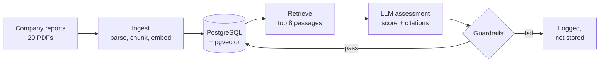

# Impact Lens

Impact Lens scores listed companies against impact investing themes, using only what the companies say in their own annual and sustainability reports. Each score has to point to the page it came from. If a quote or a figure doesn't match the source, the answer is thrown out.

I started this because I wanted to understand how an LLM-based assessment tool works from the database up, and where it goes wrong. The second part turned out to be the more interesting one.

It isn't finished. The database, the document pipeline, the assessment step and the guardrails all work. I haven't yet measured accuracy against my own labels, and there's no review screen or portfolio view.

## How it works



Each report is read page by page and cut into passages of about 300 words, which keep their page number. A small embedding model on my laptop turns every passage into a vector, and all of it goes into PostgreSQL.

To assess a company on a theme, I pull the eight passages closest in meaning to the theme definition and hand them to the model with a fixed prompt. It returns a score from 0 (no exposure) to 3 (core business), a short rationale, and a citation with an exact quote for each claim. If the passages don't support a score, it's supposed to say so.

Then the answer is checked before anything is saved.

## What gets checked

| Check | What it catches |
| --- | --- |
| Schema | The answer has the wrong shape or a value out of range. It gets one retry |
| Citation exists | The model cites a passage it was never given |
| Quote matches | The quote isn't in the cited passage |
| No evidence, no claim | A score above 0 without a single valid citation |
| Revenue share supported | A percentage that isn't written in a cited passage |
| Injection | Passage text that reads like an instruction to the model. Flagged only |

## What I found so far

I ran 20 companies against 4 themes, so 80 assessments, with Claude Haiku 4.5 and the first version of my prompt.

- The 20 reports came to 8,328 passages.
- 72 assessments were stored and 8 were rejected.
- 6 of the rejections were altered quotes. 3 were a revenue share the source doesn't state. One answer managed both.
- Two more answers failed the schema check and passed on the retry.

Ten percent rejected sounds fine until you look at which ones. All 8 were cases where the company really does have exposure to the theme. Most of the 80 are easy zeros, like a tobacco company on clean energy. Of the 27 that aren't, about 30% were rejected.

The Shell result is the one I keep coming back to. On clean energy the model gave a score of 2, high confidence, and a revenue share of 15%. The citations were real. But the 15% came from a chart of energy delivered by volume, which isn't revenue, and it treated all power sales as clean. It read well and the main number was wrong.

## Built with

- Python 3.12
- PostgreSQL 16 with pgvector, in Docker
- SQLAlchemy 2 and Alembic
- PyMuPDF for reading PDFs
- sentence-transformers (bge-small-en-v1.5), run locally
- Anthropic API, with Pydantic to validate the answers

## Running it

You need Docker, Python 3.12 and an Anthropic API key.

```bash
git clone <this repo>
cd impact-lens
python3.12 -m venv .venv && source .venv/bin/activate
pip install -r requirements.txt

cp .env.example .env          # then put your API key in .env
docker compose up -d          # database on port 5433
alembic upgrade head          # create the tables
python -m app.seed            # companies, themes, demo portfolio
```

The reports aren't in this repository because they belong to the companies. `data/sources.csv` lists each one with its URL. Download them into `data/raw/` under the filenames given there, then:

```bash
python -m ingest.run          # parse, chunk, embed and load
python -m ingest.quality      # data quality report
python -m agent.run_all       # assess every company and theme
```

To try a single pair and see the output:

```bash
python -m agent.assess "Vestas Wind Systems" CLEAN_ENERGY
```

I pinned the library versions for an Intel Mac, where PyTorch stops at 2.2. On newer hardware you can loosen them.

## Where things are

```
app/          settings, database connection, table definitions, seed data
ingest/       PDF parsing, chunking, embeddings, loader, quality checks
agent/        retrieval, prompt, assessment call, guardrails, full run
migrations/   schema history (Alembic)
data/         sources.csv is committed, the PDFs in raw/ are not
DECISIONS.md  why I built it this way, and what went wrong
```

## Why it's built this way

[DECISIONS.md](DECISIONS.md) has the full reasoning. The short version: nothing is overwritten, so there's a record of what the model said and what a reviewer changed. Each assessment stores the model, the prompt version and the passages it cited. The database enforces the valid values. Loading can be rerun safely. And I only use the companies' own reports, with no outside ESG ratings.

## What it can't do yet

There are 20 companies with one report each, so nothing here is statistically solid. The model scores generously when a report talks a lot about a theme. Charts that get flattened into text can be misread, as Shell showed. Rejected assessments are logged but nobody is asked to look at them. And without a labelled test set I can't give an accuracy figure.

## Next

I've labelled 40 company and theme pairs to measure the model against. I set the scoring thresholds and the labels are my judgement. I used an AI assistant for a first draft and checked the difficult ones against the reports. They weren't blind, because I had already seen the model's output when I labelled them. The next step is an eval script that compares the model with these labels, and a second prompt tested against the first. After that comes a review screen for approving or correcting assessments, then portfolio exposure by theme, tests and a cloud deployment.


## How the gold labels were made

I fixed the scale to rough revenue shares first: 3 is about two thirds of revenue or more, 2 is a main business line, 1 is a real activity under about a fifth, 0 is nothing meaningful. An AI assistant drafted the 40 labels. I then checked the hard ones against the reports and changed one. The labels weren't blind, since I'd seen the model's scores by then. A cleaner test would use labels written before any model run, ideally by someone else.

Page numbers are positions in the PDF, which is what my pipeline stores. In Veolia's report each PDF page is a double-page spread, so PDF page 9 shows printed page 15.

### Hard calls I could verify

- **Veolia, water: 2.** Water is 39.9% of revenue (page 9). It's the largest of three activities but well short of two thirds, so not a 3.
- **Veolia, clean energy: 2.** Energy, mostly district heating and bioenergy, is 25.4% of revenue (page 9).
- **Novonesis, health: 1.** Human Health is 26% of the Food & Health division, which is 45% of sales. That makes it about 12% of the group (pages 8 and 26).
- **Novonesis, sustainable food: 2.** Food & Beverages is 74% of the same division, about a third of the group, and agriculture sits in the other division (page 8).
- **Novonesis, water: 0.** I had this at 1 and changed it. The report only mentions wastewater at its own factories (pages 58 and 72). I found no water product line.
- **Siemens, health: 2.** Healthineers is consolidated, "with Siemens as majority shareholder" (page 4). The report doesn't give its share of revenue.

### Hard calls I couldn't verify from my documents

- **Siemens, clean energy: 2.** No segment split in the report. 69.2% of revenue is EU Taxonomy-eligible and 29.3% is aligned (page 19), which supports "material" but isn't a segment figure.
- **ABB, clean energy: 2.** No segment split. 45% of turnover is Taxonomy-eligible and 1% aligned (pages 142 and 143). The report points to Note 23 of the Financial Report for revenue by business area (page 25).
- **ABB, water: 1.** Nothing in the report either way. This label rests on what I know of ABB's end markets.
- **Schneider, clean energy: 3.** The report names two businesses, Energy Management and Industrial Automation, without a split (page 32). 89% of revenue is Taxonomy-eligible and 32% aligned (page 106). I believe energy management is most of revenue but couldn't confirm it here.
- **Philip Morris, health: 0.** Smoke-free products reduce harm from its own product and don't treat disease. Its wellness and healthcare business is mentioned without a figure (pages 2 and 25), so I can't tell if it's big enough for a 1.

### Hard calls I haven't checked yet

- **Danone and Nestlé, water: 0.** I treated bottled water as a drink, not as water supply or treatment. If selling water counted as "supply", both would go up. I applied the same rule to both.
- **Geberit, water: 2.** Piping and water-saving flushing fit the theme. Bathroom ceramics and furniture don't, in my view, and that keeps it from a 3.
- **Danone, sustainable food: 2, against Nestlé and Unilever: 1.** I scored Danone higher because its portfolio is built around dairy, plant-based and specialised nutrition. I'm not certain the gap is justified.
- **ExxonMobil, clean energy: 0, against Shell: 1.** Shell generates renewable power and runs EV charging. I don't believe Exxon does either at any scale.

### Measured against my own labels

I labelled 40 of the harder pairs by hand and compared two prompt versions.

| | Prompt v1 | Prompt v2 |
| --- | --- | --- |
| Passed guardrails | 32 of 40 | 35 of 40 |
| Exact match with my score | 53% | 57% |
| Within one point | 91% | 94% |
| Average difference (model minus me) | +0.31 | +0.14 |

The second prompt cut rejections and made the model less generous, but exact agreement hardly changed. The model still gives the top score too easily, and it says "high confidence" almost every time, right or wrong. I tuned v2 on the same 40 pairs, so the gain is an upper bound. The labels were drafted with an AI assistant and checked by me against the reports, and they weren't blind.

