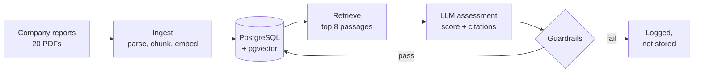

# Impact Lens

Impact Lens scores listed companies against impact investing themes, using only what the companies say in their own annual and sustainability reports. Each score has to point to the page it came from. If a quote or a figure doesn't match the source, the answer is thrown out.

I started this because I wanted to understand how an LLM-based assessment tool works from the database up, and where it goes wrong. The second part turned out to be the more interesting one.

It isn't finished. The database, the document pipeline, the assessment step and the guardrails all work. I haven't yet measured accuracy against my own labels, and there's no review screen or portfolio view.

## How it works



Each report is read page by page and cut into passages of about 300 words, which keep their page number. A small embedding model on my laptop turns every passage into a vector, and all of it goes into PostgreSQL.

To assess a company on a theme, I pull the eight passages closest in meaning to the theme definition and hand them to the model with a fixed prompt. It returns a score from 0 (no exposure) to 3 (core business), a short rationale, and a citation with an exact quote for each claim. If the passages don't support a score, it's supposed to say so.

Then the answer is checked before anything is saved.

## What gets checked

| Check | What it catches |
| --- | --- |
| Schema | The answer has the wrong shape or a value out of range. It gets one retry |
| Citation exists | The model cites a passage it was never given |
| Quote matches | The quote isn't in the cited passage |
| No evidence, no claim | A score above 0 without a single valid citation |
| Revenue share supported | A percentage that isn't written in a cited passage |
| Injection | Passage text that reads like an instruction to the model. Flagged only |

## What I found so far

I ran 20 companies against 4 themes, so 80 assessments, with Claude Haiku 4.5 and the first version of my prompt.

- The 20 reports came to 8,328 passages.
- 72 assessments were stored and 8 were rejected.
- 6 of the rejections were altered quotes. 3 were a revenue share the source doesn't state. One answer managed both.
- Two more answers failed the schema check and passed on the retry.

Ten percent rejected sounds fine until you look at which ones. All 8 were cases where the company really does have exposure to the theme. Most of the 80 are easy zeros, like a tobacco company on clean energy. Of the 27 that aren't, about 30% were rejected.

The Shell result is the one I keep coming back to. On clean energy the model gave a score of 2, high confidence, and a revenue share of 15%. The citations were real. But the 15% came from a chart of energy delivered by volume, which isn't revenue, and it treated all power sales as clean. It read well and the main number was wrong.

## Built with

- Python 3.12
- PostgreSQL 16 with pgvector, in Docker
- SQLAlchemy 2 and Alembic
- PyMuPDF for reading PDFs
- sentence-transformers (bge-small-en-v1.5), run locally
- Anthropic API, with Pydantic to validate the answers

## Running it

You need Docker, Python 3.12 and an Anthropic API key.

```bash
git clone <this repo>
cd impact-lens
python3.12 -m venv .venv && source .venv/bin/activate
pip install -r requirements.txt

cp .env.example .env          # then put your API key in .env
docker compose up -d          # database on port 5433
alembic upgrade head          # create the tables
python -m app.seed            # companies, themes, demo portfolio
```

The reports aren't in this repository because they belong to the companies. `data/sources.csv` lists each one with its URL. Download them into `data/raw/` under the filenames given there, then:

```bash
python -m ingest.run          # parse, chunk, embed and load
python -m ingest.quality      # data quality report
python -m agent.run_all       # assess every company and theme
```

To try a single pair and see the output:

```bash
python -m agent.assess "Vestas Wind Systems" CLEAN_ENERGY
```

I pinned the library versions for an Intel Mac, where PyTorch stops at 2.2. On newer hardware you can loosen them.

## Where things are

```
app/          settings, database connection, table definitions, seed data
ingest/       PDF parsing, chunking, embeddings, loader, quality checks
agent/        retrieval, prompt, assessment call, guardrails, full run
migrations/   schema history (Alembic)
data/         sources.csv is committed, the PDFs in raw/ are not
DECISIONS.md  why I built it this way, and what went wrong
```

## Why it's built this way

[DECISIONS.md](DECISIONS.md) has the full reasoning. The short version: nothing is overwritten, so there's a record of what the model said and what a reviewer changed. Each assessment stores the model, the prompt version and the passages it cited. The database enforces the valid values. Loading can be rerun safely. And I only use the companies' own reports, with no outside ESG ratings.

## What it can't do yet

There are 20 companies with one report each, so nothing here is statistically solid. The model scores generously when a report talks a lot about a theme. Charts that get flattened into text can be misread, as Shell showed. Rejected assessments are logged but nobody is asked to look at them. And without a labelled test set I can't give an accuracy figure.

## Next

I'm labelling about 40 company and theme pairs by hand, so I can measure the model against my own judgement and test a second prompt against the first. After that comes a review screen for approving or correcting assessments, then portfolio exposure by theme, tests and a cloud deployment.